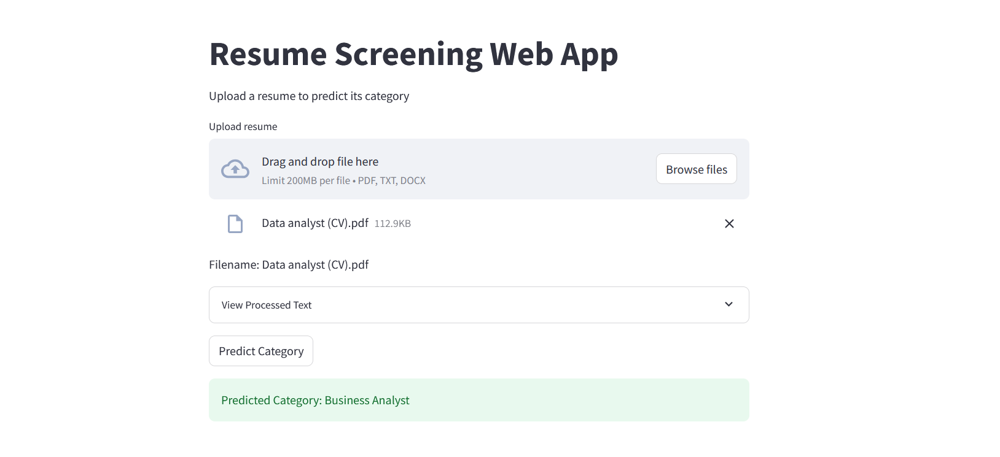

# Resume Screening Web App

This repository contains a  web application for resume screening. The app predicts the category of an uploaded resume using a pre-trained machine learning model. It processes the uploaded file, cleans the text, and applies a TF-IDF vectorizer before making predictions.





## Features
- Upload resumes in PDF, TXT, or DOCX format.
- Clean and preprocess resume text for analysis.
- Predict the category of the resume using a trained model.
- Display the cleaned text and predicted category.

## Installation

### Prerequisites
Make sure you have the following installed:
- Python 3.9 or higher
- pip (Python package manager)

### Steps
1. Clone the repository:
    ```bash
    git clone <repository-url>
    cd <repository-directory>
    ```
2. Install the required packages:
    ```bash
    pip install -r requirements.txt
    ```
3. Download the necessary NLTK resources:
    ```bash
    python -c "import nltk; nltk.download('punkt'); nltk.download('stopwords')"
    ```

## Files
- **`app.py`**: The main Streamlit app script.
- **`best_model.pkl`**: The pre-trained model for predicting resume categories.
- **`tfidf_vectorizer.pkl`**: The TF-IDF vectorizer used for text transformation.
- **`label_encoder.pkl`**: The label encoder for decoding category predictions.

## Usage
1. Start the Streamlit app:
    ```bash
    streamlit run app.py
    ```
2. Open the app in your browser (default: `http://localhost:8501`).
3. Upload a resume file (PDF, TXT, or DOCX).
4. Click the "Predict Category" button to see the predicted category.

## Functions

### `cleanResume(txt)`
Cleans and preprocesses the text from resumes. The cleaning steps include:
- Removing URLs, mentions (@), hashtags (#), and special characters.
- Removing extra whitespaces and newline characters.
- Converting text to lowercase.

### `main()`
The main function that runs the Streamlit app. It handles file uploads, text cleaning, and category prediction.

## Requirements
Ensure you have the following Python packages installed:
```
streamlit
pandas
numpy
nltk
pickle
```

## Important Notes
- Ensure the model and supporting files (`best_model.pkl`, `tfidf_vectorizer.pkl`, `label_encoder.pkl`) are in the same directory as the app.
- Uploaded files must be in a supported format (PDF, TXT, or DOCX).

## Troubleshooting
If you encounter issues:
- Verify that the model, vectorizer, and label encoder files are properly loaded.
- Ensure the uploaded file's text can be decoded (UTF-8 or Latin-1).
- Check for compatibility of installed Python libraries.

## Acknowledgments
- **NLTK** for text preprocessing.
- **Streamlit** for building the user interface.
- Machine learning model trained using scikit-learn.


## Author
Developed by Bisma Shafiq.


